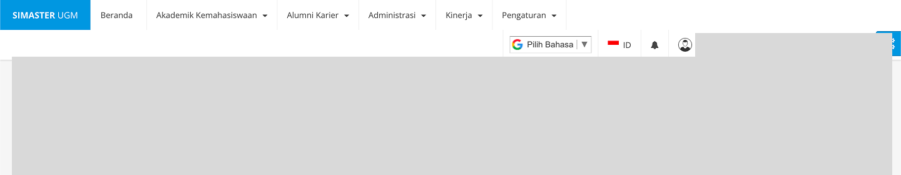
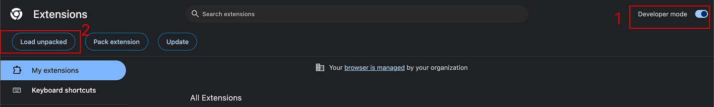
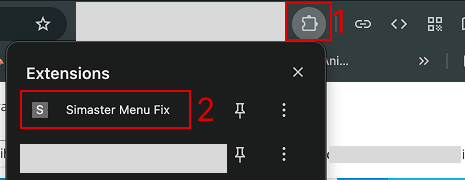
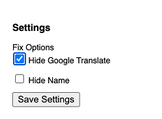
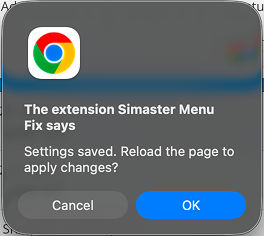

# Simaster UGM Top Menu Fix

## Background

Simaster UGM Website has a minor issue where the left and right navigation menus are stacked. It will make the main content covered. So I decided to create a Chrome extension that will fix the issue based on the fix option that I've selected.

## Installation

1. Download the unpacked extension from the [release menu](https://github.com/mbaguszulmi/simaster-menu-fix/releases). Then extract it.
2. Go to [chrome://extensions/](chrome://extensions/). Enable Developer mode, then Load unpacked. Select the extracted folder.
   
    
3. After that, go to Simaster website, then open the extension settings.
   
    
4. Adjust the settings to match your own preference. Then hit the "Save Settings" Button.
   
    
5. The confirmation prompt will open. Hit "OK" to restart and apply the changes.
   
   

## Limitations

- This will only work on Chrome
- Since this is just a local change, the fix will only be applied on Chrome on Desktop/Laptop/Mac devices, where the extension is installed. You can enable Google Chrome sync to make it work on other devices.
- It doesn't work on Chrome for mobile devices. The website doesn't have the issue on the mobile version anyway.

## Support me ❤️

